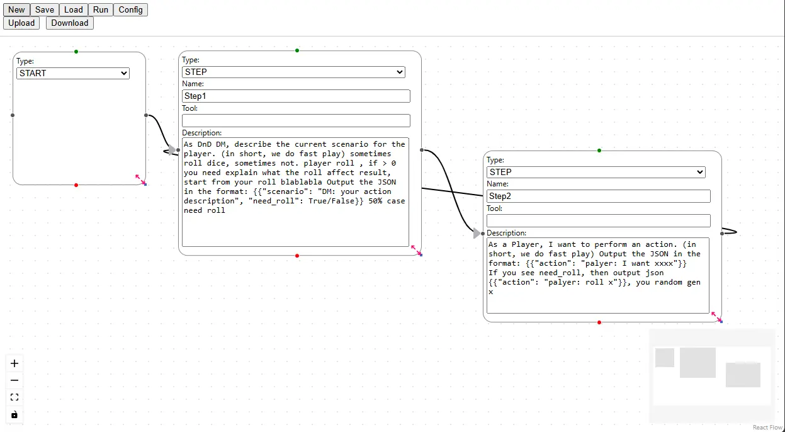
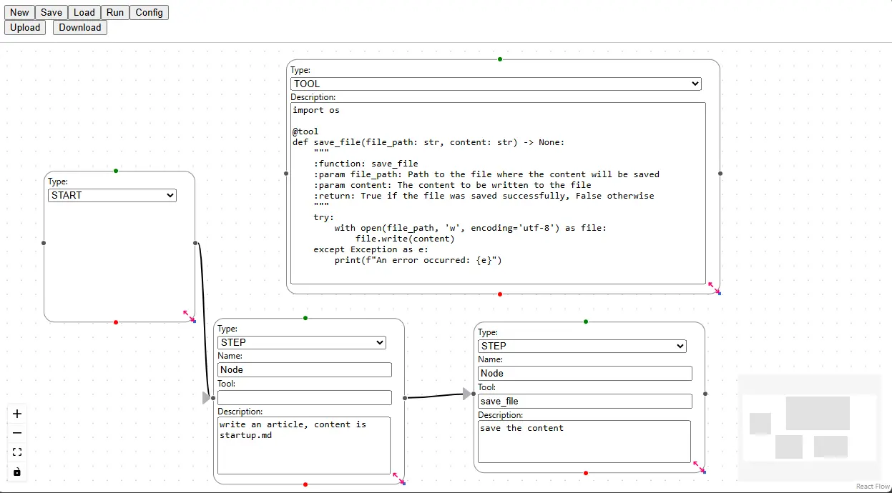
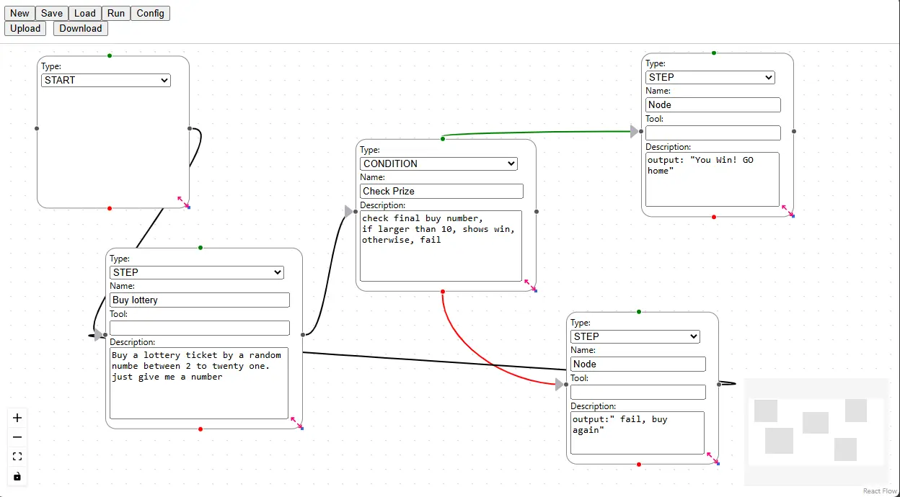

# Graph Examples
repo at [LangGraph-GUI/examples](https://github.com/LangGraph-GUI/examples)

Remembmer, these examples are act different output and process on different llm model.

To make better output, you need modify or refine prompts.

## Simple DND Play

This example shows simple loop flow that a player and a hoster on TRPG.

## Save File

This example shows simple tool and save file

## Lottery

This example shows simple condition switch to different branch

## DND Play

This example merges tool using and condition branch