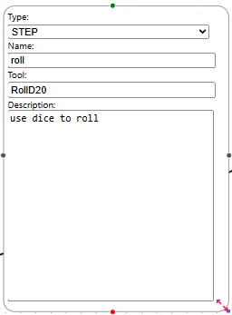
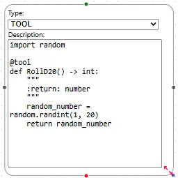
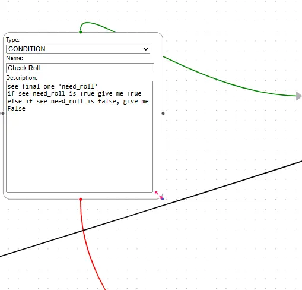
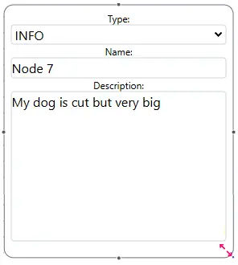

# GUI Graph

## Explanation

#### Start Node
A graph(json) only have one start node, this will mapping to LangGraph START

#### Step Node
Step Node will mapping to LangGraph add_node, you can drag edge from left node(right port) to right node(left port)

if you drag two node toward to each other, can create cycle.

#### Step Node with tool
Step node fill tool will call function, the tool definition need a tool node

#### Tool Node
Tool node need write real python function code, and need `@tool` decorator like LangChain Custom Tools

#### Contition Node
CONDITION node will mapping to LangGraph conditional_edge

* green edge is true case path
* red edge is false case path

## Other Resource
*If you want to learn more about LangGraph, we have LangGraph for dummy : [LangGraph-learn](https://github.com/LangGraph-GUI/LangGraph-learn)*

#### Information Node
INFO node do nothing, just append info to previous stage output

