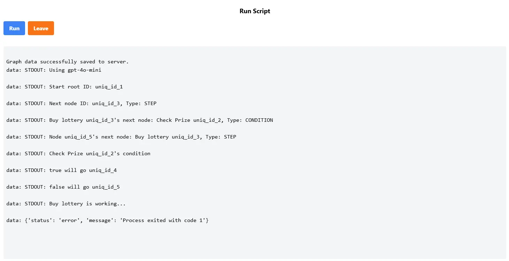

# Run Graph
This will Run workflow.json on server.
That is, you need upload graph.json first.

## Run
Execute workflow.json into LangGraph with LLM.
After Run, recommand get files from server.

## Leave
Leave run menu

## Text Space
Show infomation when server running
