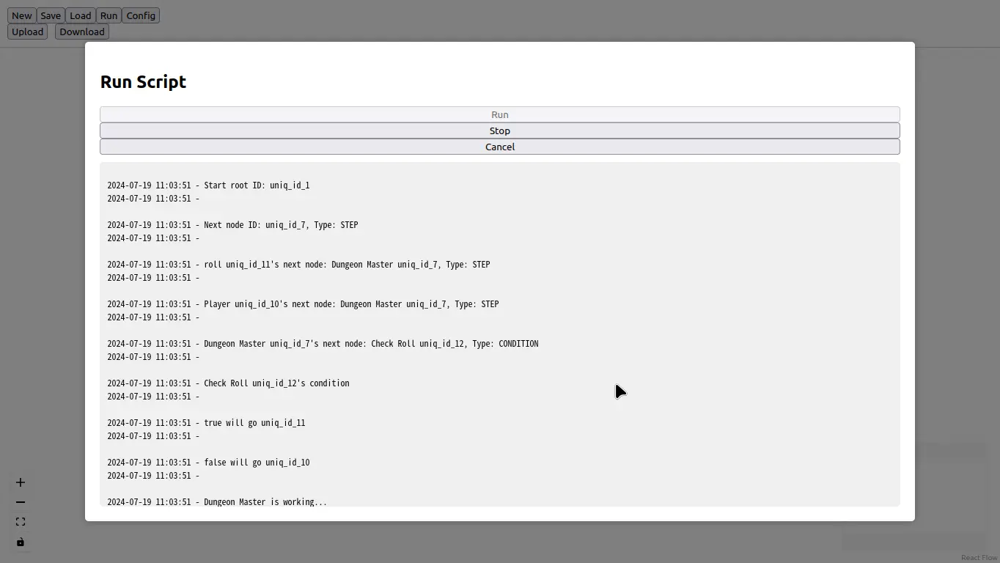

# Run Graph
This will Run graph.json on server.
That is, you need upload graph.json first.

## Run
Execute graph.json into LangGraph with Ollama.
After Run, recommand download files.

## Stop
To terminal remote running server. (Currently, many bugs. If stuck, plese restart docker compose)

## Cancel
Leave run menu

## Text Space
Show infomation when server running