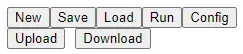

# UI

There are several buttoms  

## New

New will clean the canvas.

## Save

Save the graph into json to your computer.

## Load
Read the graph json from your computer.

## Run
Run graph.json on server, for more info, see [Run](./Run)

## Upload 
a file to server env, for Run.
* upload graph.json for Run on server
* upload other file for workflow data

## Download
download all files from server such generated files and log file