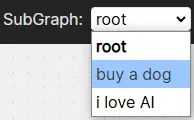
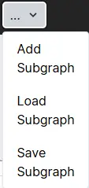

# UI

## Graph Panel

There are several buttoms  

### New Graph

New will clean the canvas.

### Save Graph

Save the graph into json to your computer.

### Load Graph
Read the graph json from your computer.

## SugGraph Panel
### subgraphs select

change to edit specific subgraph

### subgraph control

## Add
Add new subgraph

## Load Subgraph
upload a subgraph

## Save Subgraph
save single subgraph

