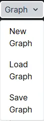

# UI

There are several buttoms  

## New Graph

New will clean the canvas.

## Save Graph

Save the graph into json to your computer.

## Load Graph
Read the graph json from your computer.

## Run Graph
Run graph.json on server, for more info, see [Run](./Run)

## Config
* set what llm you want to use
* api key