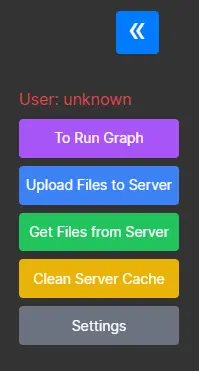

# UI

There are several buttoms  

## Upload Files to Server

Send file to workspace as environment, for such file processing.

## Get Files from Server

After process with LLM, download all files in workspace.

## Clean Server Cache
Remove all files at workspace